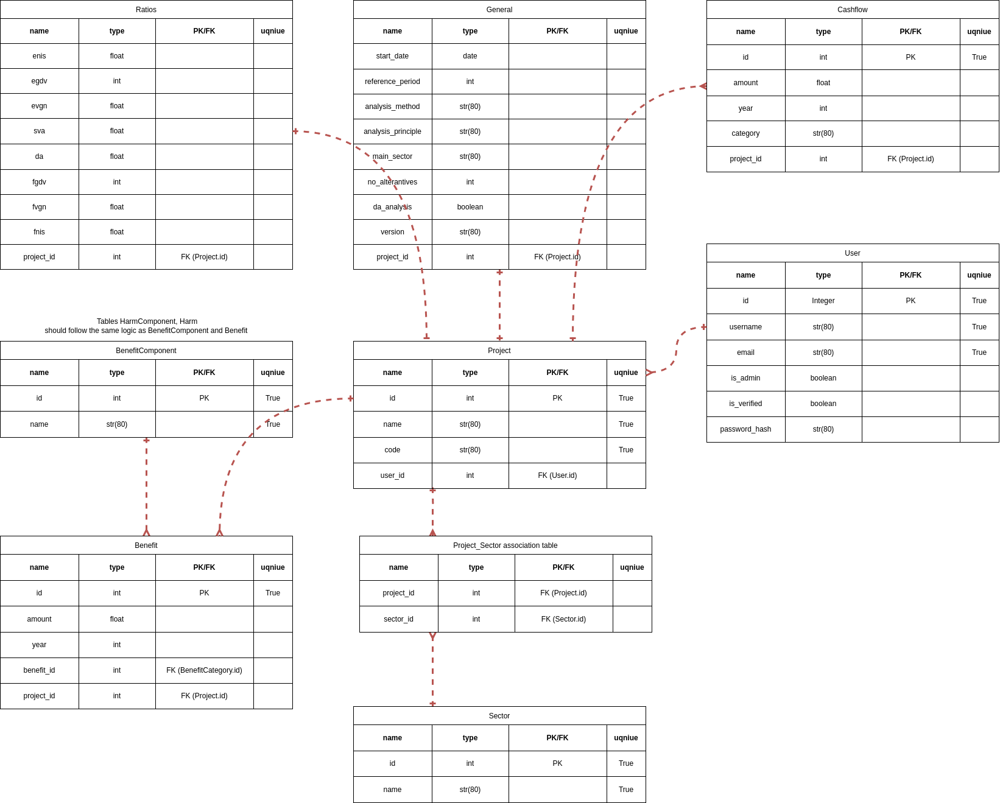

# National progress plans data extraction project
Deployed application is available at: [pazangos-priemones.eu/](https://pazangos-priemones.eu/)

## Project Context
In Lithuania, strategic investment planning involves preparing various programming-level documents, one of which is the development program. Primarily prepared by ministries, development programs address significant issues and challenges within their respective areas of state activity. To tackle these problems, development programs also outline planned national progress plans to be implemented. 

The creation of national progress plans involves assessing both financial and economic impacts. Ministries use a standardized .xlsm format spreadsheet to compile financial and economic cash flow projections and to evaluate the relevant indicators for these plans.

This project is a web application that enables registered and verified users to upload national progress plan spreadsheets. Its main purpose is to extract data from the uploaded spreadsheets, record it to a database, and perform visualization for both aggregate and plan-specific data.

## Project Description

### Main technologies used
This project is being developed using the **Flask** web framework, selected for its flexibility and ease of customization. The application is deployed using **nginx** and **Gunicorn** on an Ubuntu 24.04 server. To enable HTTPS, **Let's Encrypt** SSL certificate is used.

Data extraction from Excel spreadsheets is handled by **Openpyxl**, which provides an easy solution for reading Excel files. The extracted data is then stored in a **SQLite** database. Given the relatively small project's scale, a more specialized database technology was unnecessary. SQLite is also chosen for its simplicity and seamless integration with **SQLAlchemy** and **Flask-Migrate**, which are utilized for database operations. 

For data visualization, **Plotly** is the main tool used, allowing for the creation of interactive and dynamic figures. Plotly's compatibility with **pandas**, which is employed to fetch and normalize data from the database, enhances its effectiveness in visual data representation. 

User authentication is managed by **Flask-Login**, chosen for its straightforward session management and user-friendly syntax. **Flask-Mail** is used to set up SMTP and send emails, providing a reliable solution for email communication. To securely collect data through HTML forms, **WTForms** is used, offering a simple yet secure method for form handling and validation. 

For the admin dashboard, **Flask-Admin** is utilized, allowing for efficient account and project management and administrative tasks.

**Bootstrap 5.3.3** is used for the application front-end, selected for its clean and simple styling.

### Project structure
This project is organized using blueprints to structure the application code effectively. The blueprints used in this project include:
- admin: to manage code for admin views.
- auth: to manage code related to user actions such as Login, Registration, Logout, Account deletion, Password updating, Password reset, User notification via emails.
- core: to manage code for horizontal pages - Main, About, Privacy Policy, Terms of Service, and Cookie Policy.
- dashboard: to manage code for user operations related to national progress plans uploaded by specific user.
- projects: to manage code for displaying all national progress plans uploaded by all users.
- upload: to manage code related to uploading and extracting data from Excel spreadsheets and recording it to the database.

### Main functionality
- All users can view aggregate data of all uploaded national progress plans.
- All users can search for uploaded national progress plans and view specific national progress plan data.
- Not registered user can register.
- When registering a user must enter a complex password.
- When a new user registers, an email is sent to the registration email.
- When a new user registers, an email is sent to all admin users' emails.
- Registered and verified user can login.
- Registered user can reset their password. A reset token is sent to user email.
- A logged-in user can upload national progress plans.
- A logged-in user can search for national progress plans uploaded by themself.
- A logged-in user can delete national progress plans uploaded by themself.
- A logged-in user can update their password.
- A logged-in user can delete their account.
- An admin user can verify users.
- An admin user can make another user an admin user.
- An admin user can update national progress plans names and codes.
- An admin user can delete any user and any uploaded national progress plan.
- Projects in the dashboard and projects sections are paginated to display only five records at a time.

### Development process
This application is being developed in stages. In each stage, the main objectives and requirements are set. Only after completing one stage are new objectives and requirements set for the next stage. Development stages, objectives, and requirements are outlined in [specification.md](https://github.com/Dronzillla/flask_pzp_project/blob/main/specification.md)

In the first stage, a database diagram was drawn using [app.diagrams.net](https://app.diagrams.net/) to model how information in Excel spreadsheets should be recorded in database tables:


## How to use this Project locally
1. **Create folder for your project**:
    ```sh
    mkdir pzp-project
    cd pzp-project
    ```

2. **Create and activate virtual environment**:
    ```sh
    python -m venv venv
    source venv/bin/activate
    ```

3. **Create .env file**:    
    ```
    MAIL_USERNAME_SECURED="gmail email address that will serve as a website email address"
    MAIL_PASSWORD_SECURED="gmail app password for an email address"
    ADMIN_USERNAME="The username for the administrator account"
    ADMIN_EMAIL="The email address associated with the administrator account"
    ADMIN_PASSWORD="The password for the administrator account"
    SECURITY_PASSWORD_SALT="A random string used to add an additional layer of security to password hashing processes"
    SECRET_KEY="A random string used for security-related functions, such as session management, token generation, etc."
    ```

4. **Clone github repository**:
    ```sh
    git clone git@github.com:Dronzillla/flask_pzp_project.git
    cd flask_pzp_project/
    ```

5. **Install requirements**:
    ```sh
    pip install -r requirements.txt
    ```

6. **Initialize the database**:
    ```sh
    cd blueprintapp/
    flask db init
    flask db migrate
    flask db upgrade
    ```

7. **Run the application**:
    ```sh
    cd ../
    python3 run.py
    ```

## Testing
During development, manual tests were performed to ensure that the application works as intended.

For automated testing, **pytest** is used. There are still many automated tests missing. The automated tests are organized into folders based on seven scenarios that consider user type:
1. Anonymous user.
2. Registered, logged-in, verified, not an admin user.
3. Registered, logged-in, verified, an admin user.
4. Registered, not logged-in, verified, not an admin user.
5. Registered, not logged-in, verified, an admin user.
6. Registered, not logged-in, not verified, not an admin user.
7. Registered, not logged-in, not verified, an admin user.  

A folder structure like this will ensure structured and comprehensive coverage of the application's functionality for different user states. Tests are then further separated into folders named based on blueprint names to align the tests with the application's blueprint structure. 

To run tests or generate a test coverage report, change the current working directory to the project github repository folder and run the respective commands: 
1. **To run tests**: 
    ```sh
    pytest
    ```
2. **To generate test coverage report**:
    ```sh
    pytest --cov=blueprintapp
    ```

## Credits
Contributors' names and contact info:
* Dominykas (https://github.com/Dronzillla)